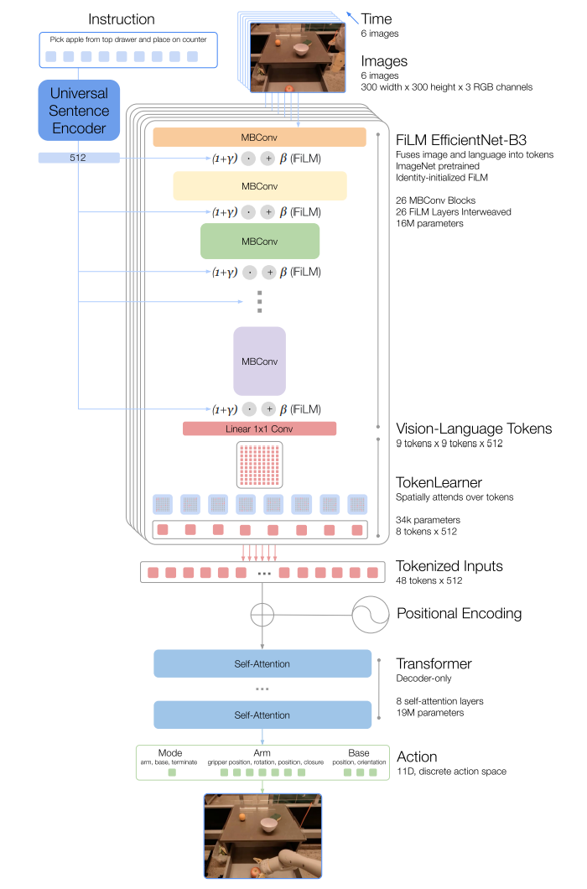

# RT-1: Robotics Transformer For Real-World Control at Scale

## RT-1

* Goal:  large multi-task backbone model on data consisting of a wide variety of robotic tasks
* Challenges: assembling the right dataset(关联性，兼具规模和广度的数据集) and designing the right model(高容量高效)
* Method: treats the mapping of language and vision observations to robot actions as a sequence modelling problem, using a Transformer to learn this mapping

* Steps: Images and Instructions Input -> EfficientNet-B3(ImageNet pre-trained) -> Token Learner -> Transformer

* Model:  ==Instruction and Image Tokenization== (300*300(Input) -> 9\*9\*512(Final Convolutional Layer) -> 81 Vision Language Tokens) -> ==Token Learner==( -> 8 Final Tokens) -> ==Decoder-only Transformer== ( -> 48 total tokens with added position encoding) -> ==Action Tokenizer==( -> 7 variables with 256 bins)
* Loss: Cross Entropy and Casual Masking
* Speeding: Reduce the number of tokens generated using token learner, compute the tokens only once

## Experiments

- [x] To perform a large number of instructions, and to generalize to new tasks, objects and environments
- [x] Absorbing simulation data and data from different robots

* Key: Data diversity is more essential than data quantity

## Future Work

* Extension of the set of instructions
* Improve the reaction speeds and context retention through scalable attention and memory.

## Appendix

* Model Selection at Scale: Real to Sim Transfer <mark>RetinaGAN
* Evaluation Details: Seen Tasks, Unseen Tasks, Distractor Robustness, Background Robustness, Realistic Instructions

 

